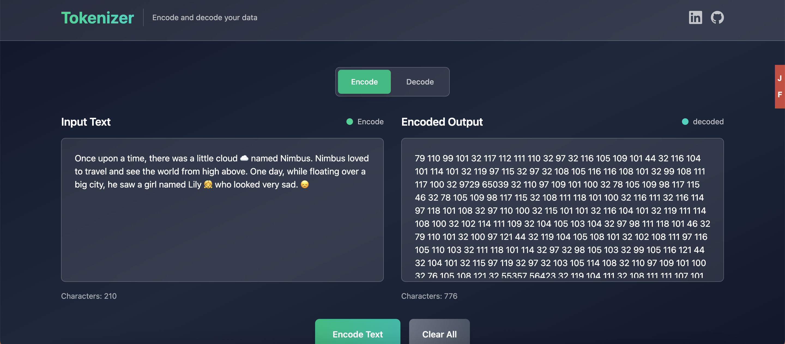

# 🔐 Tokenizer

This is a simple web application that takes your input and tokenizes it using Unicode characters and vice-versa.



📹 **Demo Video**: [Watch the demo](https://x.com/BaluTirupathi/status/1955067956041306412)

## 📖 How to Use

### Encoding Text

1. **Select "Encode" mode** (default)
2. **Enter your text** in the left textarea
3. **Click "Encode Text"** button
4. **View the result** - each character is converted to its Unicode code point

**Example:**

```
Input:  "Hello"
Output: "72 101 108 108 111"
```

### Decoding Text

1. **Switch to "Decode" mode**
2. **Enter Unicode code points** separated by spaces in the left textarea
3. **Click "Decode Data"** button
4. **View the result** - code points are converted back to readable text

**Example:**

```
Input:  "72 101 108 108 111"
Output: "Hello"
```

### Clearing Content

- **Use "Clear All" button** to reset both input and output areas
- **Character counters** show the length of current content

## 🛠️ Technical Details

### Tech Stack

- **Frontend Framework**: React 19.1.1
- **Language**: TypeScript 5.8.3
- **Styling**: Tailwind CSS 4.1.11
- **Build Tool**: Vite 7.1.0
- **Package Manager**: npm

### Key Components

#### Encoding Algorithm

```typescript
const encoded = input.split("").map((char) => {
  return char.codePointAt(0);
});
setOutput(encoded.join(" "));
```

#### Decoding Algorithm

```typescript
const decoded = input.split(" ").map((char) => {
  return String.fromCodePoint(parseInt(char));
});
setOutput(decoded.join(""));
```

## 🚀 Quick Start

### Prerequisites

- Node.js (version 16 or higher)
- npm or yarn package manager

### Installation

1. **Clone the repository**

   ```bash
   git clone https://github.com/Balusekhar/tokenizer.git
   cd tokenizer
   ```

2. **Install dependencies**

   ```bash
   npm install
   ```

3. **Start the development server**

   ```bash
   npm run dev
   ```

4. **Open your browser**
   Navigate to `http://localhost:5173` to see the application